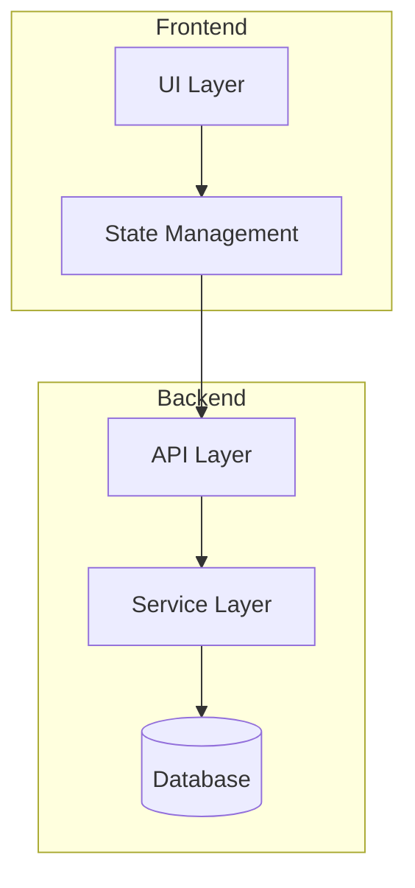

# Architecture Overview

<!-- Phase 2 of the top-down arc: "Meet the components."
     Generated during /setup — replace with actual architecture. -->

> [!NOTE]
> This page introduces the building blocks. You don't need to understand every detail yet.

## System Diagram

<!-- Replace with a Mermaid diagram of the actual project architecture.
     Example below — adapt to the real structure detected during /setup. -->

## Components

<!-- For each major component, one short paragraph:
     What is it? What does it own? What does it depend on? -->

### <!-- Component 1 -->

### <!-- Component 2 -->

### <!-- Component 3 -->

## Tech Stack

| Layer | Technology | Purpose |
|-------|-----------|---------|
| <!-- layer --> | <!-- tech --> | <!-- why --> |

## Key Patterns

<!-- List 2-4 architectural patterns used in this project.
     Example: "Repository pattern for data access", "Event-driven messaging between services" -->
