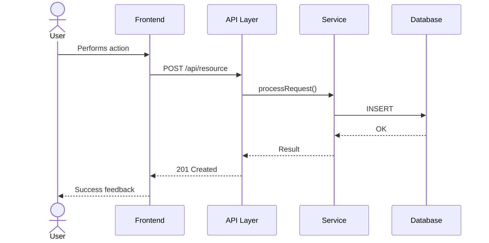

# Workflows — How Components Communicate

<!-- Phase 3 of the top-down arc: "Trace a real request end-to-end."
     Generated during /setup — replace with actual workflows. -->

> [!NOTE]
> Pick any user action and follow the data through the system. This is where architecture becomes concrete.

## End-to-End: <!-- Primary User Flow -->

<!-- Sequence diagram showing the most important user flow.
     Replace with a real flow detected during /setup. -->

## Data Flow Patterns

<!-- Describe how data moves through the system.
     Use tabs for different flow types if applicable. -->

<!-- tabs:start -->

#### **Read Flow**

<!-- How data is fetched: caching, query patterns, pagination -->

#### **Write Flow**

<!-- How data is created/updated: validation, persistence, events -->

#### **Error Flow**

<!-- How errors propagate: error boundaries, retry logic, user feedback -->

<!-- tabs:end -->

## Integration Points

<!-- External systems the project communicates with.
     APIs, message queues, third-party services, etc. -->

| System | Protocol | Purpose |
|--------|----------|---------|
| <!-- system --> | <!-- REST/gRPC/etc --> | <!-- why --> |
